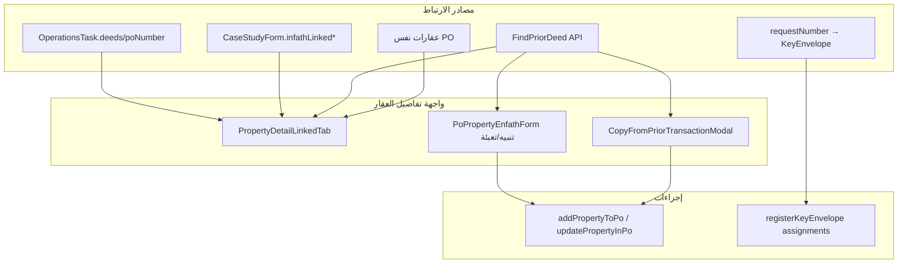

# دورة العقارات المرتبطة — الوضع الحالي

> **آخر مراجعة:** 29 يوليو 2026
> **النطاق:** كل ما يُعرَض ويُخزَّن ويُستهلك حول «ارتباط» عقار بعقار آخر داخل نظام إجادة — تبويب **العقارات المرتبطة**، نسخ المعاملة السابقة، الأصول المرتبطة في دراسة الحالة، وارتباط الظرف/المهام.

---

## جواب سريع: ماذا تعني «العقارات المرتبطة»؟

في النظام الحالي، كلمة **مرتبط** لا تعني أن المستخدم ضغط زر «ربط» وأن النظام أنشأ
علاقة دائمة بين سجلين. لا يوجد جدول `PropertyLink`، ولا `LinkedPropertyId` داخل
`WorkOrderProperty`.

النظام **يستنتج الارتباط وقت العرض** من واحد أو أكثر من المؤشرات التالية:

1. العقاران موجودان داخل أمر العمل نفسه.
2. رقم الصك الحالي ظهر في أمر عمل آخر.
3. الأخصائي صرّح في نموذج دراسة الحالة بأن الأصل مرتبط بأرقام صكوك أخرى.
4. توجد مهمة تشغيلية تحمل رقم أمر العمل أو رقم الصك.
5. يوجد رقم طلب `requestNumber` مشترك تستخدمه دورة ظرف المفاتيح.

لذلك:

- إضافة عقار ثانٍ إلى PO تجعله يظهر تلقائياً تحت **«على نفس أمر العمل»**.
- إعادة استخدام رقم صك في PO آخر تجعله يظهر تحت **«نفس الصك في أمر عمل سابق»**.
- كتابة رقم صك في «الأصول المرتبطة» تحفظ **تصريحاً نصياً** فقط؛ لا تنشئ عقاراً ولا
  تتحقق من وجوده ولا تجعل العلاقة ثنائية الاتجاه.
- «نسخ من معاملة سابقة» **ينسخ البيانات** إلى العقار الهدف؛ لا ينشئ رابطاً دائماً
  إلى المصدر. استمرار ظهور المصدر لاحقاً سببه تطابق رقم الصك.
- حذف أحد المؤشرات أو تغييره يغيّر نتيجة العرض؛ لا توجد علاقة مستقلة تبقى بعد ذلك.

### الكلمات المستخدمة في النظام

| الكلمة في الواجهة | المعنى التقني |
|---|---|
| العقارات المرتبطة | شاشة تجميع runtime لأربعة مصادر ارتباط |
| نفس PO | عقار شقيق في `WorkOrder.Properties` |
| تسجيل سابق | أحدث `WorkOrderProperty` آخر يحمل رقم الصك نفسه |
| مصرّح به | رقم صك نصي داخل `CaseStudyForm.InfathLinkedDeedNumbers` |
| المهام التشغيلية | `OperationsTask` يطابق PO أو الصك |
| الصك / الخانة المستهدفة | العقار الموجود أو مهمة `case-study-property` الفارغة التي ستستقبل النسخ |
| المعاملة السابقة | سجل المصدر الذي أعاده `FindPriorDeed`، وقد يكون في نفس PO عند النسخ |
| نطاق النسخ | `enfath` للبيانات الأولية، أو `bourse` للأولية وبيانات البورصة |
| العقارات المرتبطة بالطلب | عقارات تحمل `requestNumber` نفسه في دورة المفاتيح |

---

## 1. المفهوم

«العقارات المرتبطة» ليست كياناً واحداً في قاعدة البيانات، بل **طبقة عرض ومنطق** تجمع أربعة مصادر ارتباط مختلفة حول عقار (`WorkOrderProperty`) واحد:

| # | نوع الارتباط | المعيار | مصدر البيانات |
|---|-------------|---------|---------------|
| 1 | **نفس أمر العمل (PO)** | عقارات أخرى في `record.properties` | Work Order |
| 2 | **نفس الصك — معاملة سابقة** | `deedNumber` مسجّل سابقاً في PO آخر (أحدث تسجيل) | `FindPriorDeed` API |
| 3 | **أصول مصرّح بها** | الأخصائي أجاب «نعم» في دراسة الحالة + أرقام صكوك | `CaseStudyForm` |
| 4 | **مهام تشغيلية** | مهمة ops مرتبطة بـ PO أو الصك | `OperationsTask` |

بالإضافة إلى ذلك، يوجد **ارتباط جانبي** (لا يظهر في تبويب «العقارات المرتبطة» لكنه مرتبط بالموضوع):

| # | نوع | المعيار |
|---|-----|---------|
| 5 | **ظرف مفاتيح** | كل عقارات إجادة بنفس `requestNumber` | `KeyEnvelopes` |
| 6 | **إعفاء مسحي** | صك سبق تسجيله → يُعتبر المسح «منجزاً» في قائمة العقارات | `PropertyListRowBuilder.PriorSurveyWaived` |

---

## 1.1 من يرى ومن يعدّل؟

الوصول إلى صفحة العقار لا يكفي وحده لتنفيذ كل إجراء. هناك فرق بين عرض التبويب،
البحث عن تسجيل سابق، نسخ البيانات، وإنشاء مهمة تشغيلية.

| الإجراء | الأدوار المسموح لها فعلياً |
|---|---|
| فتح تفاصيل العقار وتبويب «العقارات المرتبطة» | كل دور لديه وصول مصرّح إلى العقار/PO بحسب نطاقه |
| عرض عقارات نفس PO | كل من استطاع تحميل أمر العمل؛ القائمة مشتقة من `record.properties` |
| البحث Backend عن نفس الصك / تسجيل سابق | يتطلب `manage-work-orders`: `cdo`, `general-manager`, `section-supervisor`, `case-specialist` |
| نسخ بيانات من معاملة سابقة | زر النسخ مربوط بـ `canEditProperty`: `cdo`, `case-specialist` |
| إدخال «الأصول المرتبطة» في دراسة الحالة | الأخصائي ضمن نموذج دراسة الحالة، مع قواعد ملكية/إسناد النموذج |
| إنشاء مهمة تشغيلية من التبويب | `cdo`, `general-manager`, `section-supervisor`, `case-specialist` |
| قراءة عقارات مرتبطة برقم الطلب في المفاتيح | Controller المفاتيح يتطلب سياسة `read-key-data`: أصحاب `manage-operations` أو `manage-financial` |

### أثر الصلاحية على التبويب

`PropertyDetailLinkedTab` يستدعي `findPriorDeedFull`، لكن endpoint
`GET /api/work-orders/deeds/prior` يتطلب `manage-work-orders`. إذا كان المستخدم يستطيع
فتح العقار لكنه لا يحمل هذه الصلاحية (مثل المقيم العقاري)، يعيد wrapper نتيجة `null`
ولا يظهر قسم «نفس الصك في أمر عمل سابق». لا تعرض الواجهة رسالة «غير مصرح» لأنها
تعامل أي فشل في البحث كعدم وجود نتيجة.

مرجع الأدوار والصلاحيات الكامل:
[`USERS_ROLES_AND_TERMS.md`](./USERS_ROLES_AND_TERMS.md).

---

## 2. واجهة المستخدم

### 2.1 تبويب «العقارات المرتبطة»

**المكوّن:** `apps/mfe-case-study/src/components/po-intake/PropertyDetailLinkedTab.tsx`  
**يُستدعى من:** `PoPropertyDetailTabs.tsx` — تبويب `linked` ضمن تفاصيل العقار.

**الأقسام المعروضة:**

```
┌─ العقارات المرتبطة ─────────────────────────────┐
│ ℹ  شرح أنواع الارتباطات                        │
├─ المهام التشغيلية ──────────────────────────────┤
│   قائمة مهام + رابط إنشاء مهمة (للمصرّح لهم)   │
├─ على نفس أمر العمل ────────────────────────────┤
│   روابط لعقارات PO الأخرى                      │
├─ نفس الصك في أمر عمل سابق ─────────────────────┤
│   رابط لـ PO/عقار السابق                       │
└─ أصول مرتبطة (من دراسة الحالة) ────────────────┘
    أرقام صكوك + ملاحظات (بدون ربط تلقائي بسجل)
```

**حالة فارغة:** رسالة توضّح أن الارتباطات تشمل: PO، تسجيل سابق، تصريح الأخصائي.  
إذا `expectedPropertyCount > properties.length` يُعرَض تنبيه بعدد العقارات المتوقع.

> **فجوة عرض حالية:** المتغير `hasAny` يحسب `samePoLinks`, `prior`, و`declared`
> فقط، ولا يحسب `propertyOpsTasks`. لذلك إذا كانت المهمة التشغيلية هي الارتباط الوحيد،
> يرجع المكوّن مبكراً إلى «لا توجد عقارات مرتبطة» ولا يعرض قسم المهام رغم وجودها.
> تظهر المهمة في `PropertyDetailMobileGlance`، لكن ليس داخل التبويب حتى يوجد نوع
> ارتباط آخر.

لا يوجد حالياً عدّاد رقمي على تبويب «العقارات المرتبطة». شريط التبويبات قد يعرض
نقطة «جديد» العامة فقط عبر `propertyTabHasNewDot`.

### 2.2 نظرة سريعة (موبايل)

**المكوّن:** `PropertyDetailMobileGlance.tsx`  

- إذا توجد مهمة تشغيلية مرتبطة، تعرض البطاقة المهمة الأساسية وعدد المهام وتفتح
  المهمة مباشرة.
- إذا لا توجد مهمة، يعرض زر «لا مهام مرتبطة — عرض الارتباطات» ويفتح تبويب `linked`.

### 2.3 نسخ من معاملة سابقة

**المكوّن:** `CopyFromPriorTransactionModal.tsx`  
**نقاط الدخول:**

| الشاشة | الملف | الإعداد |
|--------|-------|---------|
| قائمة عقارات PO | `PoPropertiesPage.tsx` | قائمة ⋮ → نسخ من معاملة سابقة |
| طوابير المعاملات النشطة | `ActiveTransactionQueueView.tsx` | `allowCopyFromPrior: true` |
| مهامي | `MyTasksView.tsx` | `allowCopyFromPrior: true` |

**التدفق:**

1. اختيار الهدف: عقار موجود أو **خانة فارغة** (`empty-slot` / مهمة `case-study-property` بدون `propertyId`).
2. إدخال رقم الصك والبحث → `findPriorDeedFull`.
3. اختيار نطاق النسخ:
   - `enfath` — البيانات الأولية (إنفاذ)
   - `bourse` — الأولية + بيانات البورصة (إن وُجدت)
4. تنفيذ `copyPropertyFromPriorTransaction`.

**قيود مهمة:**

- لا نسخ صك من **نفس PO** إلى خانة فارغة (الصك موجود مسبقاً).
- لا استبدال عقار بصك شقيق على نفس PO (تعارض unique-deed).
- تأكيد عند استبدال بيانات موجودة.

### 2.4 تنبيه أثناء إدخال الصك

**المكوّن:** `PoPropertyEnfathForm.tsx`  
عند تغيير `deedNumber` يُستدعى `findPriorDeedFull` تلقائياً:

- يُعرَض `priorPo` إن وُجد تسجيل سابق.
- **تعبئة تلقائية** إن كانت الحقول فارغة: `deedDate`, `ownerName`, `contacts`.

يُستخدم أيضاً في:

- `DistributionTaskWork.tsx` — تحذير عند التوزيع
- `MyTaskWorkView.tsx` — سياق عمل المهمة

---

## 3. حقول «الأصول المرتبطة» (دراسة الحالة / إنفاذ)

### 3.1 المواصفة

**المرجع:** `docs/infath_case_study_fields.md` — القسم ٥  
**القسم في نموذج الرفع:** `infath-upload-model.ts` — `id: "linked"` / «الأصول المرتبطة»

| الحقل (عرض) | مفتاح التخزين | النوع | شرط |
|-------------|---------------|-------|-----|
| هل الأصل مرتبط بأصول أخرى؟ | `infathLinkedAssets` | `""` \| `yes` \| `no` | — |
| أرقام صكوك الأصول المرتبطة | `infathLinkedDeedNumbers` | نص (متعدد: `,` `،` `;` سطر) | عند `yes` |
| ملاحظات ربط الأصل | `infathLinkedAssetsNotes` | نص | — |

**تسميات الواجهة:** `infath-field-labels.ts`  
**كتalog الحقول:** `property-fields-catalog.ts` → `linkedAssets`, `linkedDeedNumbers`, `linkedAssetsNotes`

### 3.2 أين تُدخل؟

| السطح | الملف |
|-------|-------|
| نموذج الدراسة — قسم الأخصائي | `CaseStudyInfathSpecialistSection.tsx` |
| عرض في تبويب الأطراف / التقرير | `property-detail-party-submission-builders.ts` |
| تبويب العقارات المرتبطة | `PropertyDetailLinkedTab` — يقرأ المسودة عبر `loadCaseStudyFormDraft(taskId)` |

### 3.3 التخزين (Backend)

**الكيان:** `CaseStudyForm` (`backend/RealEstateEval.Domain/CaseStudyForm.cs`)

```csharp
InfathLinkedAssets      // empty | yes | no
InfathLinkedDeedNumbers
InfathLinkedAssetsNotes
```

**API:** `CaseStudyFormsController` + `packages/api-client/src/case-study-forms.ts`

> **ملاحظة:** أرقام الصكوك المصرّح بها **لا تُحلّ تلقائياً** إلى سجلات عقار — تُعرَض كنص فقط في التبويب.

---

## 4. API وخدمات Backend

### 4.1 البحث عن صك سابق

```
GET /api/work-orders/deeds/prior?deedNumber=&excludePo=&excludePropertyId=
```

| الطبقة | الملف |
|--------|-------|
| Controller | `WorkOrdersController.cs` |
| Service | `WorkOrderService.FindPriorDeedAsync` |
| DTO | `PriorDeedRegistrationDto` (`WorkOrderDtos.cs`) |
| Client | `packages/api-client/src/work-orders.ts` → `findPriorDeed` |
| Wrapper FE | `po-intake-storage.ts` → `findPriorDeedFull` |

**منطق البحث:**

- `IdentifierType == Deed` و `DeedNumber` مطابق
- `!IsRemoved`
- استثناء PO و/أو `propertyId` عند الطلب
- **الأحدث أولاً:** `OrderByDescending(WorkOrder.CreatedAtUtc)`

**حقول `PriorDeedRegistrationDto`:** بيانات إنفاذ + معظم بيانات البورصة (المدينة،
الحي، الحدود، المحكمة، جهات الاتصال، `bourseDataCompleted`, …).

> **فجوة عقد حالية:** `priorDeedToPropertyIntake` يحاول قراءة `region`, `regionId`,
> و`cityId`، لكن هذه الحقول غير موجودة في `PriorDeedRegistrationDto` لا في عقد
> C# ولا في type العميل. لذلك النسخ لا ينقل مراجع المنطقة/المدينة، وهذه الأسطر تسبب
> أخطاء TypeScript حالية (`TS2339`) حتى يُوحّد العقد.

### 4.2 نسخ البيانات من معاملة سابقة

**Frontend فقط** — لا endpoint مخصص:

| الدالة | الملف | الوصف |
|--------|-------|-------|
| `priorDeedToPropertyIntake` | `po-intake-storage.ts` | تحويل DTO → مسودة عقار |
| `mergePriorOntoExisting` | نفس الملف | دمج على عقار موجود حسب `scope` |
| `copyPropertyFromPriorTransaction` | نفس الملف | حفظ عبر `addPropertyToPo` / `updatePropertyInPo` |
| `finishBourseIfNeeded` | نفس الملف | إكمال البورصة إن `scope === "bourse"` |

### 4.3 عقارات مرتبطة بظرف المفاتيح

```
GET /api/key-envelopes/linked-properties?requestNumber=
```

| الطبقة | الملف |
|--------|-------|
| Controller | `KeyEnvelopesController.cs` (Operations API) |
| Service | `KeyEnvelopesService.ListLinkedPropertiesAsync` → `LoadLinkedAsync` |

**المعيار:** كل `WorkOrderProperty` حيث `RequestNumber` يطابق — غير محذوف.  
**الاستخدام:** `RegisterKeyEnvelopeModal` — تحميل تلقائي عند إدخال رقم الطلب؛ `KeyEnvelopeDetailModal` — عرض الصكوك المرتبطة.

### 4.4 فهرس الصكوك السابقة (قائمة العقارات)

**`PropertyListRowBuilder.BuildPriorDeedIndex`:**  
قاموس `deedNumber → poNumber` لكل العقارات في الطلب.

**`PriorSurveyWaived`:** المقصود أن الصك إذا سبق ظهوره في معاملة أخرى يُعتبر المسح
منجزاً ولا يُطلب رفع جديد.

> **تنبيه — السلوك الحالي أوسع من المقصود:** `BuildPriorDeedIndex` يبني القاموس من
> كل العقارات التي سيعرضها، بما فيها العقار الحالي، ثم
> `PriorSurveyWaived` يختبر فقط `priorByDeed.ContainsKey(deed)`. لذلك كل عقار بصك
> غير فارغ موجود في المجموعة يطابق نفسه، وليس فقط الصك المسجل في PO سابق. لا توجد
> مقارنة مع `poNumber` ولا ترتيب زمني داخل هذا الاختبار. النتيجة الحالية قد تعرض
> المسح `done` بلا معاملة سابقة؛ هذا خلل تنفيذ يحتاج إصلاحاً مستقلاً، وليس قاعدة عمل
> يعتمد عليها.

### 4.5 نموذج البيانات والقيود

لا توجد أعمدة ربط مخصصة. المفاتيح المستخدمة للاستنتاج هي:

| الكيان | الحقول المستخدمة |
|---|---|
| `WorkOrder` | `Id`, `PoNumber`, `CreatedAtUtc`, مجموعة `Properties` |
| `WorkOrderProperty` | `Id`, `WorkOrderId`, `IdentifierType`, `DeedNumber`, `RequestNumber`, `IsRemoved` |
| `CaseStudyForm` | `TaskId`, `PropertyId`, `InfathLinkedAssets`, `InfathLinkedDeedNumbers`, `InfathLinkedAssetsNotes` |
| `OperationsTask` | `PoNumber`, `Scope`, `Deeds`, `LinkedEnvelopeId` |
| `KeyEnvelope` / assignments | `RequestNumber`, `DeedNumber`, `PropertyId` |

الفهارس ذات الصلة:

- `WorkOrderProperties(DeedNumber)`
- `WorkOrderProperties(RequestNumber)`
- `WorkOrderProperties(WorkOrderId, DeedNumber)` — **غير unique**
- `CaseStudyForms(TaskId, IsPartyForm)` — unique للنموذج، لا لرقم الصك
- `KeyEnvelopeAssignments(EnvelopeId, DeedNumber)` — **غير unique**

قواعد الصك:

- يمنع service تكرار رقم الصك بين عقارين نشطين داخل **نفس PO**.
- يسمح بتكرار الرقم في PO مختلف، وهو أساس كشف «التسجيل السابق».
- المنع داخل PO تحقق تطبيقي في `WorkOrderService` وليس unique constraint في قاعدة
  البيانات؛ طلبان متزامنان قد يتجاوزان فحص `Any`.
- العقار المحذوف ناعماً (`IsRemoved = true`) لا يدخل prior lookup ولا
  `linked-properties` الخاص بالمفاتيح. لكن `PropertyDetailLinkedTab.samePoLinks`
  لا يفلتر `isRemoved` حالياً؛ إذا أعاد `record.properties` العقار المحذوف فسيظل
  ظاهراً كعقار شقيق على نفس PO. هذه فجوة عرض حالية.
- المطابقة حرفية بعد `Trim()`، لذلك `١٢٣` و`123` أو اختلاف المسافات الداخلية قد
  يُعامل كسجلين مختلفين.

---

## 5. المهام التشغيلية المرتبطة

**فلترة في `PropertyDetailLinkedTab`:**

```typescript
// مهمة تُعرَض إذا:
// - poNumber يطابق AND (scope = work_order | multi)
// - أو scope = transaction AND الصك في deeds[]
// - أو deeds[] يطابق deedNumber / deedDisplay
```

**إنشاء مهمة:** رابط إلى  
`/operations-tasks?create=1&type=general&scope=transaction&po=…&deed=…`  
(للمستخدمين الذين `canManageOperationsTasks(role)`).

**ربط الظرف:** مهمة `court_visit` قد تحمل `linkedEnvelopeId` بعد تسجيل الظرف (`OperationsTasksView`).

---

## 6. مخطط تدفق مبسّط



---

## 7. دورة حياة عملية (سيناريوهات)

### 7.1 PO متعدد العقارات

1. إنشاء PO بـ `expectedPropertyCount > 1`.
2. إضافة عقارات (إنفاذ / توزيع / نسخ).
3. في تفاصيل أي عقار → تبويب «العقارات المرتبطة» → قسم **«على نفس أمر العمل»**.

### 7.2 إعادة تسجيل نفس الصك (PO جديد)

1. إدخال `deedNumber` في نموذج إنفاذ → تنبيه + تعبئة جزئية.
2. أو: ⋮ → **نسخ من معاملة سابقة** → بحث → نسخ `enfath` أو `bourse`.
3. في التبويب → قسم **«نفس الصك في أمر عمل سابق»** مع رابط للـ PO القديم.
4. في قائمة العقارات → المسح قد يظهر **منجزاً** (`PriorSurveyWaived`).

### 7.3 تصريح أصول مرتبطة (دراسة الحالة)

1. الأخصائي يملأ `CaseStudyInfathSpecialistSection`.
2. `infathLinkedAssets = yes` + أرقام صكوك.
3. التبويب يعرض **«أصول مرتبطة (من دراسة الحالة)»** — بدون navigation لسجل العقار الآخر.
4. عند الرفع على إنفاذ → القسم ٥ في `infath-upload-model.ts`.

### 7.4 ظرف مفاتيح لطلب إنفاذ

1. إدخال `requestNumber` في `RegisterKeyEnvelopeModal`.
2. `GET linked-properties` → قائمة عقارات إجادة.
3. تُسجَّل كـ `assignments` على الظرف.
4. **لا تظهر** في تبويب «العقارات المرتبطة» — تظهر في تبويب **«مفاتيح العقار»**.

---

## 8. خريطة الملفات

### Frontend — Case Study MFE

| الملف | الدور |
|-------|-------|
| `PropertyDetailLinkedTab.tsx` | تبويب العرض الرئيسي |
| `PoPropertyDetailTabs.tsx` | تبويب + عدّاد + timeline |
| `CopyFromPriorTransactionModal.tsx` | نسخ من معاملة سابقة |
| `PoPropertyEnfathForm.tsx` | بحث/تنبيه/تعبئة تلقائية |
| `CaseStudyInfathSpecialistSection.tsx` | إدخال الأصول المرتبطة |
| `po-intake-storage.ts` | `findPriorDeedFull`, `copyPropertyFromPrior*`, `buildCopyPriorTargetOptions` |
| `infath-upload-model.ts` | قسم ٥ في نموذج الرفع |
| `infath-field-labels.ts` | تسميات عربية |
| `property-detail-party-submission-builders.ts` | عرض في تقارير الأطراف |
| `case-study-form-storage.ts` | مسودة `infathLinked*` |
| `ActiveTransactionQueueView.tsx` | قائمة ⋮ + modal |
| `PoPropertiesPage.tsx` | قائمة ⋮ + modal |
| `active-queue-row-menu.ts` / `po-properties-row-menu.ts` | عنصر القائمة |

### Frontend — Keys MFE

| الملف | الدور |
|-------|-------|
| `RegisterKeyEnvelopeModal.tsx` | تحميل linked + assignments |
| `KeyEnvelopeDetailModal.tsx` | عرض الصكوك المرتبطة بالطلب |
| `keys-envelope-api.ts` | عميل API |

### Backend

| الملف | الدور |
|-------|-------|
| `WorkOrderService.FindPriorDeedAsync` | بحث الصك السابق |
| `WorkOrdersController` | `deeds/prior` |
| `CaseStudyForm.cs` | حقول `InfathLinked*` |
| `KeyEnvelopesService.LoadLinkedAsync` | عقارات بنفس `requestNumber` |
| `PropertyListRowBuilder` | فهرس صك + إعفاء مسح |
| `OperationsTaskService` | `LinkedEnvelopeId` |

### Packages / Docs

| الملف | الدور |
|-------|-------|
| `packages/api-client/work-orders.ts` | `PriorDeedRegistrationDto`, `findPriorDeed` |
| `packages/api-client/case-study-forms.ts` | حقول النموذج |
| `packages/app-shared/property-fields-catalog.ts` | كatalog |
| `docs/infath_case_study_fields.md` | مواصفة إنفاذ §5 |
| `docs/standalone-property-module-fields.md` | aliases الحقول |
| `docs/ظروف_المفاتiح.md` | دورة الظرف + linked-properties API |

---

## 9. ما هو **غير** مربوط حالياً

| المتوقع | الواقع |
|---------|--------|
| كيان موحد يمثل الرابط | **غير موجود** — كل نوع ارتباط له مصدر مختلف ويُجمع وقت العرض |
| حل أرقام صكوك «الأصول المرتبطة» إلى روابط عقار | **غير منفّذ** — عرض نصي فقط |
| التحقق من وجود الصك المصرّح به | **غير منفّذ** — يقبل النص ويفصل القيم بـ `,` أو `،` أو `;` أو سطر جديد |
| علاقة ثنائية الاتجاه للتصريح | **غير منفّذ** — تصريح A عن B لا يضيف A إلى نموذج B |
| ظهور عقارات `requestNumber` في تبويب «العقارات المرتبطة» | **غير منفّذ** — في تبويب المفاتيح فقط |
| عدّاد رقمي للارتباطات | **غير موجود** — التبويب لا يحسب الأنواع الأربعة |
| API backend لنسخ من معاملة سابقة | **غير موجود** — منطق Frontend + Work Order CRUD |
| نسخ `region` / `regionId` / `cityId` | **مكسور عقدياً** — frontend يقرأ حقولاً غير موجودة في `PriorDeedRegistrationDto` |
| نسخ «خانة فارغة» يضمن نجاح الحفظ | **غير مضمون** — DTO النسخ لا يحمل كل المرفقات الإلزامية (مثل التفويض/قرار الإسناد)، وقد يفشل validation الخلفي |
| جدول `PropertyLink` أو علاقة many-to-many | **غير موجود** — اشتقاق وقت التشغيل |
| bidirectional link (A→B يظهر B→A) | **جزئي** — فقط عبر PO مشترك أو نفس deed في prior lookup |
| تطبيع رقم الصك قبل المطابقة | **محدود** — `Trim()` فقط؛ لا توحيد للأرقام العربية/اللاتينية أو الشرطات والمسافات الداخلية |
| إظهار سبب فشل prior lookup | **غير موجود** — wrapper يحوّل 403/خطأ الشبكة/404 كلها إلى `null` |
| معرفة أن إعفاء المسح سببه PO سابق فعلاً | **غير صحيح حالياً** — الفهرس يسمح للعقار أن يطابق نفسه |
| عرض مهمة تشغيلية كارتباط وحيد | **لا يعمل في التبويب** — `hasAny` لا يدخل `propertyOpsTasks` في الحساب |
| إخفاء العقار المحذوف من «نفس PO» | **غير مضمون** — `samePoLinks` لا يفلتر `isRemoved` |
| استبعاد العقار المحذوف من تقارير فوترة إنفاذ | **غير مضمون** — خدمة فوترة الإنفاذ تمر على `order.Properties` دون فلتر `!IsRemoved` |

---

## 10. اختبارات موجودة

| الاختبار | الملف |
|----------|-------|
| mapper الخاص بنتيجة الصك السابق فقط | `WorkOrderMapperTests.cs` |
| `ListLinkedPropertiesAsync` | `KeyEnvelopesServiceTests.cs` |
| نسخ/تعليق معاملة | `suspend-property-transaction.test.ts` |

لا يوجد حالياً اختبار مباشر لاستعلام `WorkOrderService.FindPriorDeedAsync`، ولا
اختبار UI لتجميع المصادر الأربعة في `PropertyDetailLinkedTab`، ولا اختبار يثبت أن
`PriorSurveyWaived` يستثني العقار الحالي.

---

## 11. مراجع تصميم (HTML prototype)

| المستند | المحتوى ذو الصلة |
|---------|------------------|
| `docs/new look/.../docs/infath_case_study_fields.md` | §5 الأصول المرتبطة |
| `docs/new look/.../uploads/_ظروف_المفاتiح.md` | linked-properties API |
| `docs/new look/.../دورة اسناد المهام.md` | §8 ارتباط المفاتيح والمهام |

---

## 12. ملخص للمطوّر

- **نقطة الدخول الرئيسية للمستخدم:** تبويب «العقارات المرتبطة» في `PoPropertyDetailTabs`.
- **الربط Structural:** PO (1:N properties) + `requestNumber` (ظرف) + `deedNumber` (prior lookup).
- **الربط Declarative:** حقول `infathLinked*` في `CaseStudyForm`.
- **الربط Operational:** `OperationsTask` scoped بـ PO/deeds.
- **الإجراء الأقوى:** `CopyFromPriorTransactionModal` + `copyPropertyFromPriorTransaction` لإعادة استخدام بيانات صك مسجّل سابقاً.

لتوسيع «الدورة» لاحقاً، المرشح الأهم: **resolver** يحوّل `infathLinkedDeedNumbers` إلى `PropertyDetailLinkedTab` entries مع روابط، وتوحيد عرض ارتباط `requestNumber` (مفاتiح) مع باقي الأنواع.
