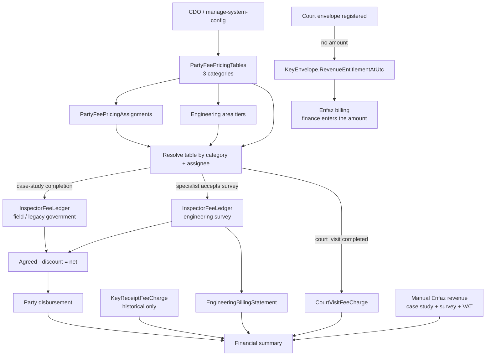

# Pricing logic — التسعيرة والتسعير في النظام الحالي

> **آخر مراجعة:** 29 يوليو 2026
> **النطاق:** كل منطق التسعيرة وأسعار أتعاب الأطراف وما يستهلكها أو يرتبط بها:
> الرفع المساحي، المعاينة الميدانية، المراجعة الحكومية، زيارة المحكمة، استلام
> المفاتيح، كشوف فوترة المكتب الهندسي، فوترة إنفاذ، الصرف، والملخص المالي.
> **قاعدة هذا المستند:** السلوك الموصوف أدناه مشتق من الكود الحالي. المستند القديم
> `docs/الماليه/منطق-التسعيرة.md` يصف نموذج singleton سابقاً ولم يعد وصفه لبنية
> التسعيرة الحالية دقيقاً.

---

## جواب سريع: ما المقصود بـ «التسعيرة»؟

**التسعيرة** في المنتج الحالي هي مجموعة **جداول أسعار مسماة** (`PartyFeePricingTable`)
مقسّمة إلى ثلاث فئات:

1. `engineering-survey` — المكاتب الهندسية / الرفع المساحي، بسعر يعتمد على شريحة
   مساحة العقار.
2. `government-review` — المراجعون الحكوميون، وفيها سعر زيارة المحكمة وسعر استلام
   المفاتيح.
3. `field-inspector` — المعاينون الميدانيون المتعاونون، بسعر للفرد وسعر للمنشأة.

لكل فئة جدول افتراضي واحد (`IsActive = true`) ويمكن إسناد جدول بعينه لطرف محدد
(`AssigneeId`). عند نشوء استحقاق، يُحلّ الجدول المناسب ويُنسخ المبلغ إلى سجل مالي
مستقل. لا يبقى على السجل رابط إلى جدول التسعيرة الذي استُخدم؛ لذلك تعديل الجدول لاحقاً
لا يعيد تسعير السجلات القديمة.

مصادر التعريف والسلوك:

- `backend/RealEstateEval.Domain/PartyFeePricingTable.cs`
- `backend/RealEstateEval.Domain/PartyFeePricingTier.cs`
- `backend/RealEstateEval.Domain/PartyFeePricingAssignment.cs`
- `backend/RealEstateEval.Application/PartyFeePricingCategories.cs`
- `backend/RealEstateEval.Infrastructure/Services/PartyFeePricingService.cs`
- `backend/RealEstateEval.Domain/InspectorFeeLedger.cs`

---

## 1. قاموس المصطلحات — Arabic / English map

| المصطلح في الواجهة أو الكود | المعنى الفعلي |
|---|---|
| **التسعيرة** / fee pricing | إعداد جداول الأسعار الافتراضية والمخصصة للأطراف؛ الصفحة `fee-pricing` |
| جدول التسعير / pricing table | سجل مسمى من `PartyFeePricingTable` ينتمي إلى فئة واحدة |
| افتراضي للفئة / category default | الجدول ذو `IsActive = true`؛ fallback عند عدم وجود إسناد صريح، مع استثناء المكتب الهندسي الموضح لاحقاً |
| إسناد التسعيرة / pricing assignment | ربط `AssigneeId` بجدول واحد داخل الفئة عبر `PartyFeePricingAssignment` |
| سعر الجدول | المبلغ الذي حُلّ عند نشوء الاستحقاق ثم خُتم في `InspectorFeeLedger.AgreedFeeSar` |
| الأتعاب المتفق عليها / agreed fee | المبلغ المختوم على سجل الطرف؛ قد يكون من جدول أو إدخالاً يدوياً لمعاين موظف |
| الحسم / supervisor discount | `SupervisorDiscountSar` مع `DiscountReason`؛ ينقص من المتفق عليه |
| الصافي / net fee | `max(0, AgreedFeeSar - max(0, SupervisorDiscountSar))` |
| تعديل التسعير | تسمية واجهة لحسم المشرف على بند مكتب هندسي؛ لا يغيّر جدول التسعيرة |
| خلاف تسعير / pricing dispute | حالة `disputed` بعد اعتراض المكتب على الحسم؛ ليست كيان تفاوض مستقل |
| أتعاب الزيارة | `GovernmentReviewFeeSar`؛ تُختم في `CourtVisitFeeCharge` عند إكمال مهمة تشغيلية `court_visit` |
| أتعاب استلام المفاتيح | **خارج التسعيرة** — إيراد للشركة من إنفاذ. تسجيل ظرف بسيناريو المحكمة يضع `KeyEnvelope.RevenueEntitlementAtUtc` كمؤشر استحقاق بلا مبلغ، والمالية تُدخل المبلغ ضمن فوترة إنفاذ. سجلات `KeyReceiptFeeCharge` تاريخية |
| أتعاب المعاملة / أتعاب الأطراف | سجلات `InspectorFeeLedger` للمعاينة والرفع والمسار القديم للمراجعة الحكومية |
| كشف فوترة / billing statement | `EngineeringBillingStatement` يجمع صافي بنود مكتب هندسي جاهزة؛ ليس جدول تسعيرة |
| فوترة إنفاذ / Enfaz billing | إيراد يدخله موظف المالية لكل عقار: دراسة حالة + رفع، مع VAT؛ لا يُقرأ من جداول التسعيرة |
| سعر التقييم | `evaluatorPrice` الذي يدخله المقيم العقاري؛ قيمة تقييم العقار وليست أتعاب طرف ولا تسعيرة |
| الملخص / التقارير المالية | تجميع لاحق للإيرادات والتكاليف من السجلات المختومة؛ لا يحل أسعاراً جديدة |

مصادر ألفاظ الواجهة:

- `packages/app-shared/src/prototype/settings-nav.ts`
- `apps/mfe-financial/src/components/FinancePartyFeePricing.tsx`
- `apps/mfe-case-study/src/components/fees/PartyFeesWorkspace.tsx`
- `apps/mfe-case-study/src/components/fees/EngOfficeFeesBillingTable.tsx`
- `apps/mfe-case-study/src/components/fees/CourtVisitFeesPanel.tsx`
- `apps/mfe-keys/src/components/KeyEnvelopeFeesPanel.tsx`
- `apps/mfe-financial/src/components/FinanceWorkspace.tsx`
- `apps/mfe-evaluator/src/extensions/party-appraisal-extensions.tsx`

---

## 2. نموذج بيانات التسعيرة

### 2.1 `PartyFeePricingTable`

**الجدول:** `financial."PartyFeePricingTables"`

| الحقل | المعنى |
|---|---|
| `Id` | GUID للجدول |
| `Name` | اسم العرض، مطلوب، حتى 128 حرفاً؛ لا يوجد unique constraint |
| `Category` | إحدى الفئات الثلاث، حتى 32 حرفاً |
| `IsActive` | هل هو الافتراضي للفئة |
| `GovernmentReviewFeeSar` | سعر زيارة/مراجعة حكومية بالريال |
| `FieldInspectorIndividualFeeSar` | سعر معاين متعاون فرد |
| `FieldInspectorOrganizationFeeSar` | سعر معاين متعاون منشأة |
| `UpdatedAtUtc` | آخر تعديل؛ لا يمثل تاريخ بدء سريان |
| `AreaTiers` | شرائح الرفع المساحي التابعة |
| `Assignments` | الأطراف المسند إليها الجدول |

يوجد unique partial index على `Category` عندما `IsActive = true`، ولذلك قاعدة البيانات
تسمح بجدول افتراضي واحد فقط لكل فئة. لا يوجد حقل عملة عام؛ العملة مثبتة دلالياً في
أسماء `*Sar` وفي الواجهة كـ `ر.س`. لا توجد حقول `EffectiveFrom` / `EffectiveTo`، ولا
رقم إصدار.

### 2.2 `PartyFeePricingTier`

**الجدول:** `financial."PartyFeePricingTiers"`

| الحقل | المعنى |
|---|---|
| `Id` | GUID للشريحة |
| `TableId` | FK إلى جدول التسعيرة، حذف Cascade |
| `SortOrder` | ترتيب الشريحة |
| `MaxAreaM2` | الحد الأعلى الشامل بالمتر المربع؛ `null` للشريحة الأخيرة المفتوحة |
| `FeeSar` | أتعاب الشريحة |

الفهرس `(TableId, SortOrder)` غير unique. الخدمة تعيد ترتيب وتطبيع الشرائح عند الحفظ
بدلاً من الاعتماد على قيد قاعدة بيانات.

### 2.3 `PartyFeePricingAssignment`

**الجدول:** `financial."PartyFeePricingAssignments"`

| الحقل | المعنى |
|---|---|
| `Id` | GUID للإسناد |
| `TableId` | FK إلى جدول التسعيرة، حذف Cascade |
| `Category` | نسخة من فئة الجدول |
| `AssigneeId` | معرّف التوزيع للطرف، مثل `eo-jeddah` |
| `UpdatedAtUtc` | وقت تحديث الإسناد |

القيد unique على `(Category, AssigneeId)` يضمن أن الطرف لا يحمل أكثر من جدول واحد
داخل الفئة. لا يوجد FK من `AssigneeId` إلى ملف مستخدم؛ الربط نصي.

### 2.4 DTOs

`PartyFeePricingDto` يجمع بيانات الجدول، الشرائح، `AssignedCount`، وقائمة
`AssignedAssigneeIds`. ملخص القائمة `PartyFeePricingTableSummaryDto` يعيد الاسم
والفئة والحالة وعدد المسندين. الإنشاء يستخدم
`CreatePartyFeePricingTableRequest(Category, Name, CopyFromTableId)`، والإسناد يستخدم
`SetPartyFeePricingAssignmentsRequest.AssigneeIds`.

المصادر:

- `backend/RealEstateEval.Application/Contracts/PartyFeePricingDto.cs`
- `backend/RealEstateEval.Infrastructure/Data/ApplicationDbContext.cs`
- `backend/RealEstateEval.Infrastructure/Data/Migrations/20260721140000_PartyFeePricingTables.cs`
- `backend/RealEstateEval.Infrastructure/Data/Migrations/20260721150000_AddPartyFeePricingCategory.cs`
- `backend/RealEstateEval.Infrastructure/Data/Migrations/20260722101800_AddPartyFeePricingAssignments.cs`

---

## 3. الفئات والأسعار وقواعد الاختيار

### 3.1 الرفع المساحي — `engineering-survey`

السعر يعتمد على مساحة العقار. البذرة الحالية:

| المساحة | السعر |
|---|---:|
| حتى 500 م² | 300 ر.س |
| 501–1000 م² | 450 ر.س |
| 1001–1500 م² | 900 ر.س |
| 1501–10000 م² | 1500 ر.س |
| أكثر من 10000 م² | 4000 ر.س |

المقارنة مع `MaxAreaM2` شاملة (`area <= max`). إذا كانت الشرائح فارغة تُعاد شرائح
البذرة. التطبيع يضمن شريحة واحدة على الأقل، حدوداً موجبة متزايدة، مبلغاً غير سالب،
وشريحة أخيرة مفتوحة. الحدود غير المتزايدة تُرفع إلى `previous + 1` بدلاً من رفض
الطلب.

استخراج المساحة في `InspectorFeeService.ResolvePropertyAreaM2Async`:

1. مساحة العقار المرتبط مباشرة بالمهمة إن أمكن تحليلها.
2. وإلا تحميل عقارات الـ PO.
3. إذا وُجدت مساحة واحدة صالحة تُستخدم.
4. إذا تعددت المساحات الصالحة تُستخدم **أكبر مساحة**.
5. يقبل المحلل نصوصاً مثل `1200` و`1,250.5` ويحذف `م²` / `م2` والمسافات؛ المساحة
   الصفرية أو غير القابلة للتحليل لا تُقبل.

وجود `AssigneeId` لمكتب هندسي بلا إسناد جدول صريح ينتج **لا سعر** (`null`) ولا يسقط
بصمت على الجدول الافتراضي. عند قبول مخرجات الرفع تتحول هذه النتيجة إلى خطأ:
`تعذر تحديد الأتعاب من جدول التسعير — راجع ضبط الأسعار.` الجدول الافتراضي لا يُستخدم
لهذه الفئة إلا عندما يكون `assigneeId` فارغاً، وهو ليس المسار الطبيعي لمكتب موزع.

المصادر:

- `backend/RealEstateEval.Application/Rules/EngineeringSurveyFeeRules.cs`
- `backend/RealEstateEval.Infrastructure/Services/PartyFeePricingService.cs`
- `backend/RealEstateEval.Infrastructure/Services/InspectorFeeService.cs`
- `backend/RealEstateEval.Application.Tests/InspectorFeeRulesTests.cs`

### 3.2 المراجعة الحكومية وزيارة المحكمة — `government-review`

يحمل جدول الفئة مبلغاً واحداً: `GovernmentReviewFeeSar` — أتعاب الزيارة.

المراجع يصنّف دائماً `متعاون فرد`. **لا سعر بذرة ولا احتياط**؛ الجدول غير المضبوط
يوقف البند بخطأ صريح.

**أتعاب الزيارة:** عند إكمال `OperationsTask.Type == "court_visit"` تنشئ
`OperationsTaskService` سجلاً واحداً `CourtVisitFeeCharge`. تختار صاحب الاستحقاق من
`CreditAssigneeId` أو `AssigneeId`، ثم تحل جدولاً مسنداً لهذا المعرّف، وإلا الجدول
الافتراضي للفئة. إذا لم يوجد سعر مضبوط **تُرفض الإكمال** برسالة «تعذر تحديد الأتعاب
— راجع ضبط الأسعار»، ويُحل السعر قبل أي تعديل على المهمة. القيد unique على
`OperationsTaskId` وفحص الوجود يجعلان الإنشاء idempotent.

**المسار القديم:** مهام workflow ذات `Kind == "government-review"` ما زالت تستطيع
إنشاء `InspectorFeeLedger` عند اكتمال دراسة الحالة، ويُحل مبلغها من الفئة نفسها.

المصادر:

- `backend/RealEstateEval.Application/Rules/GovernmentReviewFeeRules.cs`
- `backend/RealEstateEval.Infrastructure/Services/OperationsTaskService.cs`
- `backend/RealEstateEval.Domain/CourtVisitFeeCharge.cs`
- `backend/RealEstateEval.Infrastructure/Data/ApplicationDbContext.cs`

### 3.3 استلام المفاتيح — خارج التسعيرة

أتعاب استلام المفاتيح **إيراد للشركة من إنفاذ**، لا سعر مستحق لطرف، فلا ضبط سعري لها
في أي جدول تسعيرة.

عند إنشاء `KeyEnvelope` بسيناريو `court` فقط:

1. تضع `KeyEnvelopesService` مؤشر الاستحقاق `RevenueEntitlementAtUtc = now` — تسجيل
   الظرف (مع الصورة والخطاب) هو الإثبات المالي.
2. تكتب مدخلة زمنية `revenue_entitlement` تنص على أن المبلغ تُدخله المالية عند فوترة
   إنفاذ.
3. **لا تختم أي مبلغ** ولا تنشئ `KeyReceiptFeeCharge`.

سجلات `KeyReceiptFeeCharge` القائمة **تاريخية**: تبقى للقراءة والتحصيل، ويبقى بند
الإيراد في `FinancialReportService` لها وحدها فيخلو تلقائياً. تأكيد التحصيل على مؤشر
بلا مبلغ يُرفض برسالة توضح أنه ضمن فوترة إنفاذ. تقرير الأتعاب يعرض النوعين في قائمة
واحدة: التاريخية بمبالغها والمؤشرات بلا مبلغ.

حالات بند التحصيل التاريخي `open` و`collected`. حذف الظرف يحذف بند الأتعاب صراحةً؛
لا توجد علاقة FK من البند إلى الظرف في إعداد النموذج.

المصادر:

- `backend/RealEstateEval.Infrastructure/Services/KeyEnvelopesService.cs`
- `backend/RealEstateEval.Domain/KeyReceiptFeeCharge.cs`
- `backend/RealEstateEval.Application.Tests/KeyEnvelopesServiceTests.cs`

### 3.4 المعاين الميداني — `field-inspector`

تصنيف الطرف:

1. `ServiceProvider` أو `ProcProvider.ProviderKind == Organization` → `متعاون شركة`.
2. `Freelance` أو `ProviderKind == Individual` أو `EmploymentType` يحتوي `متعاون`
   → `متعاون فرد`.
3. ملف معروف لا يحقق ذلك → `موظف`.
4. إذا لم يوجد ملف: fallback قديم يجعل `fi-ahmed` متعاوناً فرداً، والباقي موظفين.

المتعاون الفرد يأخذ `FieldInspectorIndividualFeeSar`، والمنشأة تأخذ
`FieldInspectorOrganizationFeeSar`. المعاين `موظف` **خارج التسعيرة**:
`ResolveDefaultFeeAsync` يعيد `null` ويبدأ السجل بمبلغ صفر حتى يدخله مسؤول العمليات
يدوياً. لا يحتوي النموذج الحالي على سعر موظف.

المصادر:

- `backend/RealEstateEval.Application/Rules/InspectorFeeRules.cs`
- `backend/RealEstateEval.Infrastructure/Services/InspectorFeeService.cs`
- `apps/mfe-financial/src/components/FinancePartyFeePricing.tsx`

### 3.5 خوارزمية اختيار الجدول

للمهمة التي تنتمي إلى فئة:

```text
إن كان assigneeId غير فارغ وله Assignment في الفئة
    استخدم الجدول المسند، سواء كان افتراضياً أم غير افتراضي
وإلا إن كانت الفئة engineering-survey وassigneeId غير فارغ
    لا سعر
وإلا
    استخدم IsActive للفئة
```

ثم يختار `ResolveFromDto` الحقل أو شريحة المساحة المناسبة. نوع مهمة غير معروف يعيد
`null`. تسوية `Category` غير الصالحة في API لا ترفضها؛
`PartyFeePricingCategories.Normalize` يحولها إلى `engineering-survey`.

المصدر: `backend/RealEstateEval.Infrastructure/Services/PartyFeePricingService.cs`.

---

## 4. دورة حياة جدول التسعيرة

### 4.1 البذر والإصلاح الذاتي

كل عملية list/get/create/activate/delete/assign/resolve تقريباً تبدأ بـ
`EnsureAllCategoriesSeededAsync`:

- يضمن وجود فئات `engineering-survey`, `government-review`, `field-inspector`.
- إذا وجدت جداول في فئة بلا جدول نشط، يرقّي أول جدول أبجدياً بالاسم.
- إذا كانت الفئة فارغة، ينشئ `افتراضي` بمعرّف ثابت وبقيم البذرة.
- عند ترحيل البيانات القديمة، تنقل migrations أحدث singleton قديم إلى الجداول الجديدة.

بالتالي بعض عمليات **القراءة** قد تكتب إلى قاعدة البيانات لتصحيح فئة ناقصة أو بلا
نشط.

### 4.2 الإنشاء والنسخ

- ينشأ الجدول باسم مقصوص إلى 128 حرفاً؛ الفراغ يصبح `افتراضي`.
- إذا كانت الفئة بلا جداول يصبح الجديد نشطاً؛ عادةً تكون الفئات مبذورة، فينشأ غير نشط.
- `CopyFromTableId` ينسخ القيم/الشرائح من المصدر. إن لم يوجد المصدر ينسخ من النشط ثم
  الأحدث داخل الفئة.
- الواجهة تمرر الجدول المحدد داخل الفئة كمصدر.
- `CopyFromTableId` يجب أن يوجد وينتمي إلى الفئة نفسها؛ المصدر المفقود أو النسخ العابر
  للفئات يُرفضان صراحة.

### 4.3 التعديل

`SaveAsync` لا يسمح بتغيير الفئة أو `IsActive` من DTO:

- الرفع المساحي: يستبدل كل الشرائح بعد التطبيع.
- المراجعة الحكومية: يحفظ أتعاب الزيارة بعد clamp إلى `>= 0`.
- المعاين: يحفظ الفرد والمنشأة بعد clamp إلى `>= 0`.
- يحدّث الاسم و`UpdatedAtUtc`.

إذا كان الجدول مرتبطاً بطرف واحد أو أكثر فإن `SaveAsync` يرفض التعديل. تعديل أسعار
جدول مستخدم كان سيغيّر العقد الذي تُحسب منه الاستحقاقات القادمة بلا أثر تاريخي واضح.
بدلاً منه تستدعي الواجهة:

`POST /api/financial/v1/party-fee-pricing/{id}/revision`

وتنفذ `ReviseAsync` في `SaveChanges` واحد:

1. تنشئ جدولاً جديداً من نفس الفئة بالقيم المعدلة.
2. تبقي الجدول القديم ومبالغه وشرائحه كما هي.
3. تنقل كل الإسنادات من القديم إلى الجديد.
4. تنقل صفة الافتراضي إلى الجديد إن كان المصدر افتراضياً.
5. تكتب تدقيق النسخة وإعادة الربط في العملية نفسها.

الجدول المرتبط لا يُحذف كذلك حتى تُنقل إسناداته. في الواجهة يظهر التنبيه وزر
«حفظ كنسخة جديدة» بدلاً من «حفظ التسعيرة».

الجداول والشرائح والإسنادات محمية بـ PostgreSQL `xmin`. يحمل EF القيمة المحمّلة في
شرط `UPDATE`/`DELETE`، فتُرجع الكتابة المتزامنة المتأخرة `409 Conflict` بدلاً من أن
تطمس الأولى. لا يحتاج DTO إلى حمل نسخة: الحماية تغطي تداخل الطلبين أثناء دورة القراءة
والحفظ داخل الخدمة.

### 4.4 التفعيل

تفعيل جدول:

1. يحمل الجدول.
2. يعطل كل نشط آخر في الفئة.
3. يجعل المطلوب نشطاً.
4. يحفظ التغييرات مرة واحدة.

الـ partial unique index يحمي قاعدة البيانات من وجود افتراضيين في الفئة.

### 4.5 الإسناد

`SetAssignmentsAsync` هو **replace** لا append:

- trim، حذف الفراغ، وإزالة التكرار case-insensitive من الطلب.
- إزالة إسناد هذه الأطراف من أي جدول آخر في الفئة.
- حذف كل إسنادات الجدول الهدف.
- إنشاء القائمة الجديدة وتحديث `UpdatedAtUtc` في حفظ واحد.
- قائمة فارغة تفك جميع الإسنادات عن الجدول.

### 4.6 الحذف والترقية

- لا يمكن حذف آخر جدول في الفئة؛ API يعيد `400`.
- حذف جدول غير نشط يحذف شرائحه وإسناداته بـ cascade.
- حذف الجدول النشط يختار الجدول التالي **أبجدياً بالاسم** في الفئة ويجعله نشطاً.
- الحذف والترقية ينفذان ضمن `SaveChanges` واحد حتى لا تترك العملية الناجحة الفئة بلا
  افتراضي.
- يوجد اختبار مباشر لهذا السلوك في
  `backend/RealEstateEval.Application.Tests/MultiStepTransactionTests.cs`.

### 4.7 ليست Versioning زمنية

الاحتفاظ بعدة جداول يسمح بتبديل افتراضي أو تخصيص طرف، لكنه ليس versioning زمنياً:
لا effective dates، لا رقم إصدار أعمال، ولا تاريخ تفعيل. يوجد `xmin` تقني لمنع
الكتابة المتزامنة وسجل تدقيق قبل/بعد، لكنهما لا يختاران سعراً حسب تاريخ النفاذ.
لكن **جدول المصدر صار قابلاً للإثبات**: كل مبلغ مختوم يحمل `PricingTableId` الذي
حُسب منه (٤.٨).

### 4.8 ختم جدول المصدر مع المبلغ

المبلغ وحده لا يشرح نفسه، فتغيير سعر اليوم يجعل فاتورة الأمس غير قابلة للتفسير. لذلك
تعيد الخدمة المبلغ ومصدره معاً في `ResolvedPartyFee` — قيمة واحدة لا يستطيع المستهلك أن
يأخذ منها المال ويترك المصدر:

| المستهلك | العمود | متى يكون فارغاً |
| --- | --- | --- |
| `InspectorFeeLedgers.PricingTableId` | `case_study` | معاين موظف (سعره يدوي)، أو مبلغ أُدخل يدوياً |
| `CourtVisitFeeCharges.PricingTableId` | `financial` | لا يكون — البند لا يُنشأ بلا سعر من جدول |

قواعد الختم:

- جدول لم ينتج سعراً موجباً لا يُسجَّل كمصدر (`ResolvedPartyFee.Unresolved`).
- إدخال المبلغ يدوياً عبر `PATCH` **يمحو** الختم، فلا ينسب رقمٌ يدوي إلى جدول.
- العمود ليس مفتاحاً أجنبياً: التسعيرة في سياق آخر (`financial`) والدفاتر في
  `case_study`، والأهم أن الرقم يجب أن يبقى دالاً على مصدره حتى لو حُذف الجدول لاحقاً.
- استعادة تفاصيل جدول محذوف مسؤولية سجل تدقيق التسعيرة (ب٣)، لا مسؤولية الختم.
- الفهرس على العمود في الجهتين يجيب سؤال «ماذا سعّر هذا الجدول؟» عند تغيير سعر.
- `EngineeringBillingStatementLine` لا يكرر العمود: صافيه لقطة مرتبطة بـ `WorkflowTaskId`،
  فمصدره يُقرأ من الدفتر نفسه.

الاختبارات: `backend/RealEstateEval.Application.Tests/FeeProvenanceTests.cs`.

### 4.9 التدقيق والتزامن

كل عملية تغيّر التسعيرة تضيف `AuditLog` في **نفس `SaveChanges`** مع التغيير:

- إنشاء/تعديل/تفعيل/تعطيل/حذف جدول: لقطة قبل/بعد للمبالغ والشرائح.
- استبدال الإسنادات: لقطة لكل إسنادات الفئة قبل/بعد، وتشمل نقل الطرف من جدول لآخر.
- إنشاء الجدول الافتراضي أو تفعيله تلقائياً يُنسب إلى `system`.
- عمليات الإدارة من API تُنسب إلى `ActorClaims.Id(User)`.
- فشل الحفظ أو تعارض `xmin` يعني أن التغيير وسجل تدقيقه لا يُحفظان.

`PartyFeePricingTable` و`PartyFeePricingTier` و`PartyFeePricingAssignment` تستخدم
`UseOptimisticConcurrency()`، وتوحّدها طبقة الأخطاء إلى استجابة `409`.

الاختبارات:

- `backend/RealEstateEval.Application.Tests/PartyFeePricingAuditTests.cs`
- `backend/RealEstateEval.Application.Tests/OptimisticConcurrencyConfigurationTests.cs`

المصدر الرئيسي للدورة:
`backend/RealEstateEval.Infrastructure/Services/PartyFeePricingService.cs`.

---

## 5. متى وكيف تُطبّق الأسعار؟

### 5.1 المعاينة والمراجعة الحكومية القديمة

عند انتقال مهمة `case-study-property` إلى `completed`، يستدعي
`WorkflowTaskService`:

`InspectorFeeService.EnsureLedgersForPropertyAsync(propertyId)`

فتُنشأ سجلات ناقصة لمهام `field-inspection` و`government-review` فقط. لكل سجل:

- يحل نوع الطرف والجدول والسعر الحالي وقت الإنشاء.
- يختم السعر في `AgreedFeeSar`.
- يبدأ `BillingStatus = draft`.
- يضع `AccruedAtUtc`, `CreatedAtUtc`, `UpdatedAtUtc`.
- لا يعيد تسعير سجل موجود.

توجد أيضاً عملية backfill عند تحميل ملخص الأتعاب، لكنها لا تنشئ إلا للعقارات التي
اكتملت دراسة حالتها.

المصادر:

- `backend/RealEstateEval.Infrastructure/Services/WorkflowTaskService.cs`
- `backend/RealEstateEval.Infrastructure/Services/InspectorFeeService.cs`

### 5.2 الرفع المساحي

لا ينشأ استحقاق عند رفع المكتب للملفات وحده. عند قبول الأخصائي لمخرجات
`engineering-survey`:

1. يجب أن يكون submission في `submitted`.
2. يجب أن تكون المهمة `completed`.
3. يحل السعر من جدول المكتب المسند ومن مساحة العقار.
4. يجب أن يكون السعر `> 0`.
5. ينشأ/يحدث `InspectorFeeLedger` في نفس transaction التي تثبت `AcceptedAtUtc`.
6. من دون حسم يصبح `at-finance` مباشرة؛ مع حسم سابق يصبح `office-review`.
7. يضاف `InspectorFeeTransition` بسبب «استحقاق عند قبول الأخصائي...».
8. إعادة القبول لا تنشئ رسماً ثانياً إذا كان السجل مستحقاً ومبلغه موجباً.

المصادر:

- `backend/RealEstateEval.Infrastructure/Services/PartyTaskSubmissionService.cs`
- `backend/RealEstateEval.Infrastructure/Services/InspectorFeeService.cs`
- `backend/RealEstateEval.Domain/InspectorFeeLedger.cs`

### 5.3 ختم السعر وعدم الرجعية

كل المستهلكين يخزنون مبلغاً مستقلاً:

- `InspectorFeeLedger.AgreedFeeSar` مع `PricingTableId`
- `CourtVisitFeeCharge.AmountSar` مع `PricingTableId`
- `KeyReceiptFeeCharge.AmountSar` — سجلات تاريخية فقط؛ لا ختم جديد.

لا يحسب العرض هذه المبالغ من جدول التسعيرة الحي. لذلك تغيير أو تفعيل أو حذف جدول يؤثر
في الاستحقاقات **القادمة** فقط. الرفع المساحي يستخدم السعر الحي وقت قبول الأخصائي،
لا وقت توزيع المهمة أو رفع المكتب.

---

## 6. الحسم، «التفاوض»، والصرف

### 6.1 الصافي

```text
NetFeeSar = max(0, AgreedFeeSar - max(0, SupervisorDiscountSar))
```

`FeeDiscountModal` يقيد الحسم في الواجهة بين صفر والمبلغ المتفق ويتطلب سبباً إذا كان
الحسم موجباً. الخادم يطبق `>= 0` ويتحقق من وجود السبب، لكنه لا يرفض صراحةً حسماً أكبر
من المتفق؛ الصافي فقط يُثبّت عند صفر.

### 6.2 من يستطيع تغيير المبالغ؟

- `PATCH /api/inspector-fees/{workflowTaskId}` يتطلب `manage-operations`.
- `AgreedFeeSar` لا يقبل التعديل إلا إذا كان `InspectorType == موظف`.
- الحسم والاستبعاد قابلان للتعديل في الحالات التي تصنفها
  `InspectorFeeBillingRules.IsEditableStatus`.
- للرفع المساحي، إضافة حسم تنقل البند إلى `office-review`; إزالة الحسم تعيده إلى
  `at-finance` في الحالات المدعومة.

المعنى الدقيق: **مسؤول العمليات** يعدل مبلغ سجل معاين الموظف؛ ليس للموظف نفسه حق
التعديل لمجرد كونه صاحب السجل.

### 6.3 خلاف تسعير المكتب الهندسي

المسار المنفذ هو workflow حالات، لا محرك تفاوض:

```text
سعر جدول بلا حسم → at-finance
حسم مشرف → office-review
موافقة المكتب → at-finance
اعتراض المكتب + سبب → disputed
حسم الخلاف بواسطة مسؤول العمليات → at-finance
```

`resolve-dispute` لا يحسب مبلغاً تفاوضياً جديداً تلقائياً. المبلغ يظل
`AgreedFeeSar - SupervisorDiscountSar` ما لم يعدل مسؤول العمليات الحسم عبر PATCH.
أثر الحوار المتاح هو `DiscountReason` وأسباب `InspectorFeeTransition`؛ لا يوجد جدول
Negotiation أو عروض أسعار متبادلة.

### 6.4 حالات أتعاب الأطراف

`draft`, `office-review`, `disputed`, `sup-review`, `at-finance`, `deferred`,
`in-statement`, `disb-req`, `disbursed`, `returned`, `inquiry`.

التسعيرة تحدد المبلغ الابتدائي فقط؛ بقية الحالات تدير الاعتماد والتجميع والصرف.

المصادر:

- `backend/RealEstateEval.Application/Rules/InspectorFeeRules.cs`
- `backend/RealEstateEval.Application/Rules/InspectorFeeBillingRules.cs`
- `backend/RealEstateEval.Domain/InspectorFeeBillingStatus.cs`
- `backend/RealEstateEval.Infrastructure/Services/InspectorFeeService.cs`
- `packages/app-shared/src/fees/FeeDiscountModal.tsx`
- `apps/mfe-case-study/src/components/fees/PartyFeeWorkflowTable.tsx`

---

## 7. الصلاحيات: من يدير ومن يقرأ؟

### 7.1 جداول التسعيرة نفسها

| الإجراء | الحماية الفعلية |
|---|---|
| فتح صفحة `/fee-pricing` من التنقل | صفحة `fee-pricing`؛ موجودة فقط لـ `cdo` في مصفوفة الصفحات |
| List / Get جدول عبر API | `[Authorize]` فقط؛ أي مستخدم مصادق يستطيع الطلب المباشر |
| Create / Save / Activate / Assign / Delete | سياسة `manage-system-config` |

في المصفوفة الحالية، `manage-system-config` يملكه `cdo` فقط (وكذلك هوية `CDO` أو
`Admin` التي تحل إلى super-admin). `general-manager` و`financial-officer` يملكان
`manage-financial` لكن **لا يملكان** `manage-system-config` ولا صفحة `fee-pricing`.
الواجهة تعرض تنبيه «عرض فقط — تعديل التسعيرة مقصور على المسؤول» إذا فُتح المكوّن دون
الصلاحية، لكن الوصول الطبيعي للصفحة أصلاً مقصور على `cdo`.

### 7.2 قراءة وإدارة السجلات الناتجة

| المجال | قراءة / إدارة |
|---|---|
| `InspectorFeeLedger` | الأطراف تقرأ سجلاتها فقط؛ أصحاب `manage-operations` والمالية يرون الأوسع. PATCH للمشرف/العمليات. انتقالات المكتب، المشرف، والمالية موزعة حسب الفعل |
| كشوف المكتب الهندسي | المالية تنشئ/تصدر/تقفل/ترحّل؛ المكتب يرى كشوفه الصادرة والمقفلة؛ مسؤول العمليات يرى الصادر وما بعده |
| أتعاب زيارة المحكمة | مسؤول العمليات يرى الجميع؛ الطرف غير المدير يُجبر على `CreditAssigneeId` الخاص به |
| أتعاب استلام المفاتيح | Controller كله يتطلب `read-key-data`؛ تعليم التحصيل يتطلب `manage-financial` |
| فوترة إنفاذ | القراءة `read-financial-data`; الحفظ والإصدار والتنزيل `manage-financial` |
| الملخص المالي | `manage-financial` |

زر «تأكيد التحصيل (المالية)» كان يمر إلى endpoint يحميه `submit-party-work` الذي لا
يملكه `financial-officer` — أي أن النص ينسب الفعل للمالية والصلاحية تمنعها. صار الآن
`manage-financial` في الخلفية، والزر مقيّد بالصلاحية نفسها في `KeysView` و
`PartyFeesWorkspace`، ولا يظهر للمؤشرات التي بلا مبلغ مختوم.

المصادر:

- `backend/RealEstateEval.Infrastructure/Permissions/PlatformPermissionCatalog.cs`
- `backend/RealEstateEval.Application/Authorization/PlatformCapabilities.cs`
- `backend/services/financial/RealEstateEval.Financial.Api/Controllers/FinancialController.cs`
- `backend/services/case-study/RealEstateEval.CaseStudy.Api/Controllers/InspectorFeesController.cs`
- `backend/services/case-study/RealEstateEval.CaseStudy.Api/Controllers/EngBillingStatementsController.cs`
- `backend/services/case-study/RealEstateEval.CaseStudy.Api/Controllers/OperationsTasksController.cs`
- `backend/services/operations/RealEstateEval.Operations.Api/Controllers/KeyEnvelopesController.cs`
- `backend/services/case-study/RealEstateEval.CaseStudy.Api/Controllers/EnfazBillingController.cs`
- `docs/USERS_ROLES_AND_TERMS.md`

---

## 8. API التسعيرة

الـ base route:

`/api/financial/v1`

| Method | Route | DTO / نتيجة | Authorization |
|---|---|---|---|
| GET | `/party-fee-pricing/tables?category=` | `PartyFeePricingTableSummaryDto[]`، حتى 100 | authenticated |
| GET | `/party-fee-pricing/{id}` | `PartyFeePricingDto` أو 404 | authenticated |
| POST | `/party-fee-pricing` | `CreatePartyFeePricingTableRequest` → DTO | `manage-system-config` |
| PUT | `/party-fee-pricing/{id}` | `PartyFeePricingDto` → DTO | `manage-system-config` |
| POST | `/party-fee-pricing/{id}/activate` | DTO | `manage-system-config` |
| PUT | `/party-fee-pricing/{id}/assignments` | `SetPartyFeePricingAssignmentsRequest` → DTO | `manage-system-config` |
| DELETE | `/party-fee-pricing/{id}` | 204 / 404 / 400 لآخر جدول | `manage-system-config` |

ملاحظات العقد:

- لا يوجد endpoint مستقل لـ `GET assignments`; قائمة المعرفات تأتي داخل DTO الجدول.
- `IPartyFeePricingService.GetActiveAsync` يبني DTO مدمجاً من الافتراضيات الثلاثة
  للتوافق القديم، لكن Controller الحالي لا يعرض route له.
- `Save` يتجاهل `request.Id`, `request.Category`, و`request.IsActive` لأغراض تغيير
  الهوية/الفئة/الحالة؛ المسار والكيان المخزن هما المرجع.
- عميل TypeScript في `packages/api-client/src/financial.ts` وwrapper في
  `apps/mfe-financial/src/lib/financial-api.ts`.

---

## 9. APIs المالية المرتبطة

هذه ليست CRUD للتسعيرة، لكنها تستهلك المبلغ المختوم أو تعرضه:

### أتعاب الأطراف

| Method / route | الغرض |
|---|---|
| `GET /api/inspector-fees` | الملخص والسجلات مع scoping للطرف |
| `GET /api/inspector-fees/{taskId}/transitions` | سجل انتقالات البند |
| `PATCH /api/inspector-fees/{taskId}` | المبلغ اليدوي للموظف، الحسم، الاستبعاد |
| `POST /api/inspector-fees/{taskId}/transition` | إجراء دورة الصرف |
| `POST /api/inspector-fees/batch-transition` | انتقال جماعي |
| `POST /api/inspector-fees/disbursement-batch` | إنشاء أمر صرف لطرف |

### كشوف المكتب الهندسي

| Method / route | الغرض |
|---|---|
| `GET /api/eng-billing-statements/ready-lines` | بنود `at-finance` / `deferred` |
| `GET /api/eng-billing-statements` | قائمة الكشوف scoped حسب الدور |
| `POST /api/eng-billing-statements` | إنشاء كشف |
| `POST /api/eng-billing-statements/{id}/issue` | مسودة → صادر |
| `POST /api/eng-billing-statements/{id}/close` | صادر → مصروف مع فاتورة وإيصال |
| `POST /api/eng-billing-statements/defer-lines` | ترحيل بنود لدورة لاحقة |

### المحكمة والمفاتيح

| Method / route | الغرض |
|---|---|
| `GET /api/operations-tasks/court-visit-fees` | تقرير أتعاب الزيارة |
| `GET /api/key-envelopes/fee-report` | تقرير استلام المفاتيح |
| `POST /api/key-envelopes/{id}/fee-collected` | تعليم بند الاستلام محصلاً |

### إنفاذ

| Method / route | الغرض |
|---|---|
| `GET /api/enfaz-billing/ready-pos-summary` | POs المكتملة القابلة للفوترة |
| `GET /api/enfaz-billing/{po}` | بنود PO |
| `PUT /api/enfaz-billing/{po}` | حفظ إدخال المالية اليدوي |
| `GET /api/enfaz-billing/tracking` | متابعة الإدخال |
| `POST /api/enfaz-billing/{po}/issue-invoice` | إصدار/استبدال رقم الفاتورة |
| `GET /api/enfaz-billing/{po}/invoice.pdf` | تنزيل PDF |
| `GET /api/enfaz-billing/{po}/properties/{propertyId}` | إيراد العقار |

---

## 10. واجهة المستخدم

### 10.1 صفحة الإعدادات `/fee-pricing`

المسار يربط `FeePricingView` بـ `FinancePartyFeePricing`.

أهم السلوك والتسميات:

- عنوان التنقل: **التسعيرة**.
- الفئات: **المكاتب الهندسية**، **المراجعين الحكوميين**،
  **المعاينين الميدانيين**.
- قائمة جداول لكل فئة مع badges: **افتراضي** وعدد المسندين.
- إجراءات: **إضافة**، **تعيين كافتراضي**، **إسناد**، **حذف**،
  **حفظ التسعيرة**.
- الرفع: جدول **شرائح المساحة** بأعمدة من/حتى/الأتعاب وإضافة/حذف شريحة.
- الحكومة: **أتعاب الزيارة — فرد** وحدها، مع ملاحظة تشرح أن أتعاب استلام المفاتيح خارج
  التسعيرة.
- المعاين: **معاين — فرد** و**معاين — منشأة**، مع توضيح أن الموظف يدوي.
- نافذة الإسناد تعرض الأطراف المستخرجة من staff users و
  `DistributionAssigneeId`.
- زر الحذف يتعطل في الواجهة إذا لم يوجد إلا جدول واحد.
- عند إضافة جدول، الواجهة تطلب نسخه من الجدول المحدد حالياً.

المصادر:

- `apps/shell/src/components/views/FeePricingView.tsx`
- `apps/shell/src/components/views/PrototypePageView.tsx`
- `apps/mfe-financial/src/components/FinancePartyFeePricing.tsx`
- `packages/app-shared/src/prototype/settings-nav.ts`
- `packages/app-shared/src/prototype/constants.ts`

### 10.2 صفحة `/party-fees` — الأتعاب والصرف

الأدوار التي تملك الصفحة: `section-supervisor`, `field-inspector`,
`government-reviewer`, `engineering-office` إضافة إلى `cdo`.

- المعاين/المراجع: **عقاراتي وحالاتها**، **أتعاب المعاملة**،
  **أتعاب الزيارة** و**أتعاب استلام المفاتيح** للمراجع، **طلب صرف**،
  **المُعاد لي**.
- المكتب الهندسي: **تتطلب إجراءكم**، **جاهزة للفوترة**،
  **كشوف الفوترة الصادرة**.
- المشرف: **الأمور المالية**، **الحسم والمراجعة**، **كشوف الفوترة**،
  **أتعاب الزيارة**، **أتعاب استلام المفاتيح**.
- الجدول الهندسي يعرض **سعر الجدول**، **تعديل التسعير ومبرره**، **الصافي**،
  وموافقة/تحفظ المكتب.

المصادر:

- `apps/mfe-case-study/src/views/PartyFeesView.tsx`
- `apps/mfe-case-study/src/components/fees/PartyFeesWorkspace.tsx`
- `apps/mfe-case-study/src/components/field-inspection/InspectorFeesBillingTable.tsx`
- `apps/mfe-case-study/src/components/fees/EngOfficeFeesBillingTable.tsx`
- `apps/mfe-case-study/src/components/fees/EngOfficeBillingStatementsPanel.tsx`
- `apps/mfe-case-study/src/components/fees/CourtVisitFeesPanel.tsx`

### 10.3 صفحة `/financial` — التقارير المالية

`FinanceWorkspace` يعرض:

- **صرف الالتزامات**
- **فوترة المكتب الهندسي**
- **فوترة إنفاذ**
- **استعراض الأطراف**
- **التقارير**

صفحة التسعيرة ليست تبويباً هنا؛ هي إعداد مستقل للمسؤول. المالية تجمع وتدفع المبالغ
التي سبق ختمها، وتنشئ كشوف المكتب، وتدخل إيراد إنفاذ يدوياً.

المصادر:

- `apps/mfe-financial/src/components/FinanceWorkspace.tsx`
- `apps/mfe-financial/src/components/FinanceEngBillingStatements.tsx`
- `apps/mfe-financial/src/components/FinanceEnfazPoBilling.tsx`
- `apps/mfe-financial/src/components/FinancePartyDisburse.tsx`

### 10.4 إدارة المفاتيح

`KeyEnvelopeFeesPanel` يعرض:

- **تقرير أتعاب استلام المفاتيح** — المؤشرات والسجلات التاريخية في قائمة واحدة
- المؤشر: «تُدخله المالية» وحالة **بانتظار فوترة إنفاذ** بلا مبلغ ولا زر
- السجل التاريخي: المبلغ وحالة **بانتظار التحصيل** / **محصّلة** مع **تأكيد التحصيل
  (المالية)** لأصحاب `manage-financial`

يظهر داخل تجربة المفاتيح، ويعاد استخدامه في `PartyFeesWorkspace` للمراجع/المشرف.

---

## 11. مفاهيم مالية مرتبطة لكنها ليست «التسعيرة»

### 11.1 `InspectorFeeLedger` — المبلغ المطبق

هو سجل أتعاب property/task، وليس إعداد السعر. المفتاح هو `WorkflowTaskId`، ويحمل
الطرف والنوع والمتفق وجدول مصدره والحسم والحالة والاستبعاد وأمر الصرف وكشف المكتب
ووقت الاستحقاق.
يملك optimistic concurrency (`xmin`) في EF.

يحمل أيضاً `SupervisingDepartment` بقيمة canonical:

- `government-review` → `case_study`
- `field-inspection` و`engineering-survey` → `valuation`

القيمة لقطة من **قسم المعاملة** عند إنشاء البند، وليست قسم الطرف المستحق. مشرف
`section-supervisor` لا يرى في طابور الإشراف إلا بنود قسمه، ولا يستطيع تعديل الحسم أو
الاعتماد أو حسم الخلاف أو معالجة المُعاد إلا إذا طابق قسم ملفه
`SupervisingDepartment`. صلاحية `manage-operations` وحدها لا تكفي. `cdo` والمدير
العام يستطيعان الإدارة عبر الأقسام.

تُطبّع القيم القديمة في ملف المستخدم مثل «قسم دراسة الحالة» و«قسم تقييم الأفراد» إلى
`case_study` و`valuation` عند بناء صلاحياته. ترحّل المايجريشن البنود القديمة من نوع
المهمة وتضع قيد قاعدة بيانات يمنع أي قسم مجهول.

### 11.2 كشف فوترة المكتب الهندسي

`EngineeringBillingStatement` يجمع بنود رفع مساحي جاهزة لنفس المكتب:

- كل line يخزن snapshot للصافي في `NetFeeSar`.
- لا يقبل بنداً مستبعداً أو غير `at-finance` / `deferred`.
- البند لا يدخل أكثر من كشف؛ `WorkflowTaskId` unique على lines.
- الإنشاء ينقل البنود إلى `in-statement`.
- الحالات: `draft → issued → closed`.
- الإقفال يتطلب رقم فاتورة محاسبية وإيصالاً كمرفق أو مرجع، ثم يجعل ledgers
  `disbursed`.
- المرجع `FN-CS-YYMMDD-NNN`، والعداد اليومي أقصاه 999.

التسعيرة تحدد المبلغ الأولي للـ ledger؛ الكشف يجمع الصافي لاحقاً ولا يعيد التسعير.

المصادر:

- `backend/RealEstateEval.Domain/EngineeringBillingStatement.cs`
- `backend/RealEstateEval.Infrastructure/Services/EngineeringBillingStatementService.cs`

### 11.3 فوترة إنفاذ — إيراد وارد

`PoEnfazRevenueLine` يحمل لكل عقار:

- `CaseStudyFeeSar` — دخل دراسة المعاملة.
- `SurveyFeeSar` — دخل الرفع.
- `IncludedInBilling`.

الموظف المالي يدخلها يدوياً بعد أن تصبح كل عقارات PO مكتملة أو ملغاة وفق مهامها.
الحساب الخلفي:

```text
Line = CaseStudyFeeSar + SurveyFeeSar
Subtotal = مجموع البنود المكتملة والمشمولة
VAT = round(Subtotal × 0.15, 2, AwayFromZero)
Total = Subtotal + VAT
```

لا يوجد استدعاء لـ `PartyFeePricingService` ولا علاقة بجدول المكتب الهندسي؛
`SurveyFeeSar` هنا **إيراد من إنفاذ**، بينما سعر شريحة الرفع **تكلفة/التزام للمكتب**.

المصادر:

- `backend/RealEstateEval.Domain/PoEnfazRevenueLine.cs`
- `backend/RealEstateEval.Infrastructure/Services/PoEnfazBillingService.cs`
- `apps/mfe-financial/src/components/FinanceEnfazPoBilling.tsx`

### 11.4 أتعاب الزيارة مقابل استلام المفاتيح

هما بندان مستقلان:

- `CourtVisitFeeCharge`: تكلفة تُستحق للمنفذ عند إكمال زيارة المحكمة — مبلغ من التسعيرة.
- استلام المفاتيح: إيراد من إنفاذ يثبت استحقاقه بتسجيل ظرف المحكمة وصورته — **بلا مبلغ
  من التسعيرة**، مؤشر `RevenueEntitlementAtUtc` فقط. `KeyReceiptFeeCharge` سجل تاريخي.

إنشاء الظرف لا ينشئ أتعاب زيارة، وإكمال الزيارة لا يثبت استحقاق استلام. الاختبارات تثبت
الفصل في `OperationsTaskServiceTests` و`KeyEnvelopesServiceTests`.

### 11.5 سعر التقييم

`evaluatorPrice` مطلوب في إرسال المقيم العقاري ويعرض كـ **سعر التقييم** للأخصائي
للاسترشاد. لا يوجد مسار من هذا الحقل إلى `PartyFeePricingTable` أو
`InspectorFeeLedger`.

المصادر:

- `backend/RealEstateEval.Application/Rules/PropertyAppraisalSubmissionValidator.cs`
- `apps/mfe-evaluator/src/extensions/party-appraisal-extensions.tsx`
- `apps/mfe-case-study/src/components/po-intake/PropertyDetailAppraisalTab.tsx`

### 11.6 الملخص المالي

`FinancialReportService` لا يحل الأسعار؛ يجمع:

- تكاليف الأطراف من صافي `InspectorFeeLedger`.
- أتعاب الزيارة كتكلفة.
- إيراد إنفاذ + استلام المفاتيح كإيراد.
- هامش الربح = الإيراد - (تكاليف الأطراف الخارجية + أتعاب الزيارة).
- الالتزامات المعلقة من حالات ledgers غير المصروفة + زيارات `open`.

المصدر: `backend/RealEstateEval.Infrastructure/Services/FinancialReportService.cs`.

---

## 12. القيود والثوابت

1. ثلاث فئات فقط في الخدمة؛ قيمة فئة غير صالحة **تُرفض** — ٤٠٠ من الـ API
   و`ArgumentException` من الخدمة، لا تحويل صامت إلى `engineering-survey`.
2. جدول افتراضي واحد فقط لكل فئة، محمي بفهرس قاعدة بيانات.
3. لا يمكن حذف آخر جدول في فئة.
4. حذف الافتراضي يرقّي أول اسم أبجدياً في نفس الحفظ.
5. إسناد واحد كحد أقصى لكل `(Category, AssigneeId)`.
6. حذف الجدول يحذف الشرائح والإسنادات cascade.
7. مبلغ/حد سالب يطبّع إلى صفر أو إلى حد موجب متزايد؛ لكن **الصفر يعني غير مضبوط** فلا
   يُنتج بنداً. جدول رفع بلا شرائح يُرفض بـ٤٠٠.
8. الرفع يحتاج مساحة موجبة، سعراً موجباً، وإسناد جدول صريح للمكتب.
9. المعاين الموظف لا يأخذ سعراً من التسعيرة.
10. كل مبلغ يُختم مرة في سجل المستهلك؛ تغيير التسعيرة غير رجعي.
11. كل مبلغ مسعّر من جدول يُختم مع `PricingTableId`؛ الإدخال اليدوي يمحو الختم. لا
    يُحفظ اسم أو إصدار الجدول — استعادتهما مهمة سجل التدقيق.
12. `AgreedFeeSar` للمتعاون لا يعدل عبر PATCH؛ المسموح هو الحسم.
13. الحسم الموجب يحتاج سبباً؛ الصافي لا يصبح سالباً.
14. بنود المكتب الهندسي ذات الحسم تحتاج موافقة/تحفظ المكتب قبل المالية.
15. زيارة المحكمة تنتج بنداً مختوماً فريداً حسب المهمة؛ ظرف المفاتيح ينتج **مؤشر
    استحقاق بلا مبلغ** لأن أتعاب الاستلام خارج التسعيرة.
16. لا توجد effective dates أو currency column. التدقيق قبل/بعد و`xmin` موجودان،
    لكنهما ليسا versioning زمنياً للأسعار.

---

## 13. حالات طرفية وفجوات مؤكدة

هذه ملاحظات على **السلوك الحالي** وليست قواعد عمل مقترحة:

1. **إسناد المكتب إلزامي عملياً:** العبارة «افتراضي للفئة» لا تعني fallback لمكتب
   هندسي له `AssigneeId`; من دون إسناد لا ينشأ سعر.
2. ~~**المفاتيح تتجاهل الإسناد**~~ — **أُغلقت (ب٥):** أتعاب الاستلام خارج التسعيرة
   كلياً، فلا سعر ولا إسناد يخصّها.
3. ~~**لا provenance**~~ — **أُغلقت (ب٢/ب٣/ب٦):** السجل المختوم يعرف **الجدول** الذي
   حُسب منه، وجدول مستخدم لا يتغير؛ سجل التدقيق يحتفظ بلقطات الشرائح قبل/بعد.
4. ~~**لا concurrency للتسعيرة**~~ — **أُغلقت (ب٣):** الجداول والشرائح والإسنادات
   محمية بـ`xmin` ومشمولة باختبار التهيئة، والتعارض يُعاد `409`.
5. ~~**نسخ عابر للفئة ممكن من API**~~ — **أُغلقت (ب٤):** `CopyFromTableId` يجب أن يكون
   من نفس الفئة، والمصدر المفقود يُرفض بدل النسخ الصامت من جدول آخر.
6. ~~**فئة غير صالحة لا تفشل**~~ — **أُغلقت (ب٤):** تُرفض بـ٤٠٠.
7. **GET قد يكتب:** ضمان البذور قد ينشئ/يفعل جداول أثناء list/get/resolve — لكنه ينشئ
   جدولاً **فارغاً** بلا مبالغ.
8. **الحسم فوق المتفق:** الواجهة تمنعه، لكن backend لا يرفضه صراحةً؛ الصافي يصبح صفر.
9. ~~**نص زر تحصيل المفاتيح لا يطابق السياسة**~~ — **أُغلقت (ق٩):** الـ endpoint صار
   بـ`manage-financial`، والزر مقيّد بالصلاحية نفسها في الواجهتين.
10. **معاينة VAT في الواجهة:** `FinanceEnfazPoBilling` تستخدم
    `Math.round(subtotal * 0.15)` إلى ريال كامل، بينما backend يقرب إلى منزلتين
    (`AwayFromZero`). قد يختلف الإجمالي المعروض قبل الحفظ/إعادة التحميل عن الإجمالي
    المرجعي الخلفي عند وجود هللات.
11. **العقارات المحذوفة في فوترة إنفاذ:** `PoEnfazBillingService` يمر على
    `order.Properties` دون شرط `!IsRemoved`; قد تدخل عقارات محذوفة ناعماً في الجاهزية
    والعرض.
12. **تعليق area fallback لا يطابق التنفيذ حرفياً:** التعليق يقول
    `task property → sole property → max`، لكن التنفيذ بعد فشل العقار المباشر يأخذ
    مساحة واحدة إن وجدت وإلا أكبر مساحة من كل عقارات PO، ولا يفرض أن العقار «وحيد».
13. **اختبار الحذف يستخدم فئة غير رسمية:** `MultiStepTransactionTests` يستخدم
    `Category = "engineering"` ويثبت transaction فقط، لا validation الفئات الفعلية.
14. **لا endpoint للـ merged active DTO:** الخدمة تحتفظ بـ `GetActiveAsync` للتوافق،
    لكن Controller يعرض list/by-id فقط.

---

## 14. الاختبارات الموجودة

| الملف | ما يثبته |
|---|---|
| `backend/RealEstateEval.Application.Tests/InspectorFeeRulesTests.cs` | شرائح المساحة وحدودها، التطبيع، تحليل المساحة، تصنيف الأطراف، الصافي، حالات خلاف التسعير |
| `backend/RealEstateEval.Application.Tests/MultiStepTransactionTests.cs` | حذف الجدول النشط وترقية بديل في حفظ واحد |
| `backend/RealEstateEval.Application.Tests/OperationsTaskServiceTests.cs` | إنشاء أتعاب الزيارة من سعر مضبوط، رفض الإكمال بلا سعر، idempotency، وصاحب استحقاق التنفيذ |
| `backend/RealEstateEval.Application.Tests/KeyEnvelopesServiceTests.cs` | مؤشر الاستحقاق بلا مبلغ، التقرير الموحّد، تحصيل السجل التاريخي ورفض تحصيل المؤشر، الحذف، وفصله عن أتعاب الزيارة |
| `backend/RealEstateEval.Application.Tests/PartyFeePricingServiceTests.cs` | اختيار الجدول للمسند مقابل الافتراضي، منع fallback للمكتب غير المسند، رفض الفئة الخاطئة والنسخ عابر الفئة، ورفض المبالغ غير المضبوطة |
| `backend/RealEstateEval.Application.Tests/PartyTaskSubmissionAcceptTests.cs` | قبول الرفع مع استحقاق موجود وidempotency مسار القبول |
| `backend/RealEstateEval.Api.IntegrationTests/FinancialApiWebApplicationFactory.cs` | stub لعقد خدمة التسعيرة في اختبارات API |

ما زال بلا تغطية:

- CRUD/activation/assignment مع PostgreSQL والـ unique indexes (الاختبارات الحالية
  in-memory فلا تثبت الفهارس الفريدة).
- عدم رجعية الأسعار بعد تعديل الجدول.
- تطابق VAT بين واجهة Enfaz والخادم.

---

## 15. خريطة الملفات

### التسعيرة

| الملف | الدور |
|---|---|
| `backend/RealEstateEval.Domain/PartyFeePricingTable.cs` | كيان الجدول |
| `backend/RealEstateEval.Domain/PartyFeePricingTier.cs` | شرائح المساحة |
| `backend/RealEstateEval.Domain/PartyFeePricingAssignment.cs` | إسناد الطرف |
| `backend/RealEstateEval.Application/PartyFeePricingCategories.cs` | الفئات والتطبيع |
| `backend/RealEstateEval.Application/Contracts/PartyFeePricingDto.cs` | عقود API |
| `backend/RealEstateEval.Application/Rules/EngineeringSurveyFeeRules.cs` | شرائح الرفع وتحليل المساحة |
| `backend/RealEstateEval.Application/Rules/GovernmentReviewFeeRules.cs` | تصنيف/احتياط الحكومة |
| `backend/RealEstateEval.Application/Rules/InspectorFeeRules.cs` | أنواع المعاين والصافي |
| `backend/RealEstateEval.Infrastructure/Services/PartyFeePricingService.cs` | CRUD، التفعيل، الإسناد، resolution |
| `backend/services/financial/RealEstateEval.Financial.Api/Controllers/FinancialController.cs` | endpoints |
| `apps/mfe-financial/src/components/FinancePartyFeePricing.tsx` | واجهة الإدارة |
| `packages/api-client/src/financial.ts` | عميل TypeScript |

### المستهلكون

| الملف | الدور |
|---|---|
| `backend/RealEstateEval.Infrastructure/Services/InspectorFeeService.cs` | ختم أتعاب workflow |
| `backend/RealEstateEval.Infrastructure/Services/OperationsTaskService.cs` | ختم زيارة المحكمة |
| `backend/RealEstateEval.Infrastructure/Services/KeyEnvelopesService.cs` | ختم استلام المفاتيح |
| `backend/RealEstateEval.Infrastructure/Services/EngineeringBillingStatementService.cs` | تجميع وصرف كشوف المكتب |
| `backend/RealEstateEval.Infrastructure/Services/PoEnfazBillingService.cs` | إيراد إنفاذ المنفصل |
| `backend/RealEstateEval.Infrastructure/Services/FinancialReportService.cs` | التجميع المالي |

---

## 16. مخطط التدفق



---

## 17. خلاصة للمطوّر

- نقطة الإدارة: `/fee-pricing`، ويملكها `cdo` عبر `manage-system-config`.
- النموذج الحالي: جداول متعددة في ثلاث فئات، افتراضي واحد لكل فئة، وإسناد اختياري
  لكل طرف.
- الاستثناء الأهم: المكتب الهندسي ذو `AssigneeId` يحتاج إسناداً صريحاً؛ لا fallback.
- الاستحقاق يُختم على ledger/charge ولا يتغير رجعياً، لكن لا يحفظ مصدر الجدول.
- الرفع يُسعّر بالمساحة وقت قبول الأخصائي؛ المعاينة/المراجعة القديمة عند اكتمال دراسة
  الحالة؛ الزيارة عند إكمال `court_visit`; المفاتيح عند إنشاء ظرف المحكمة.
- كشوف المكتب الهندسي، فوترة إنفاذ، سعر التقييم، والملخص المالي مفاهيم مالية مرتبطة
  لكنها ليست جداول التسعيرة نفسها.
